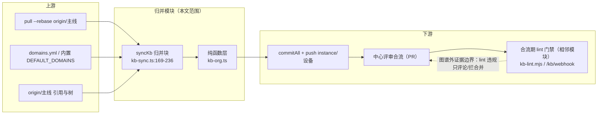
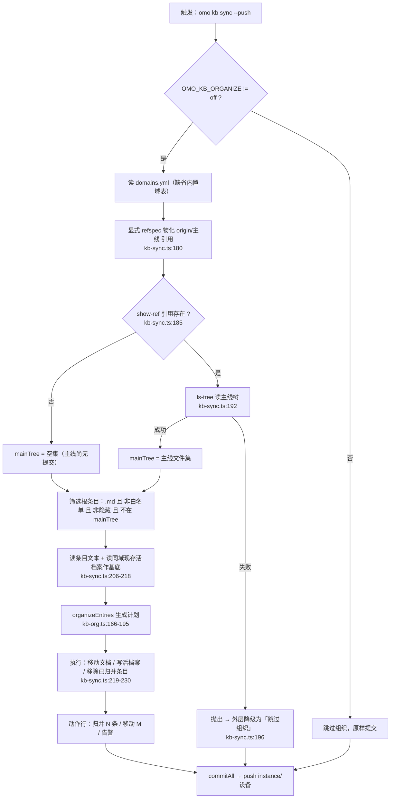
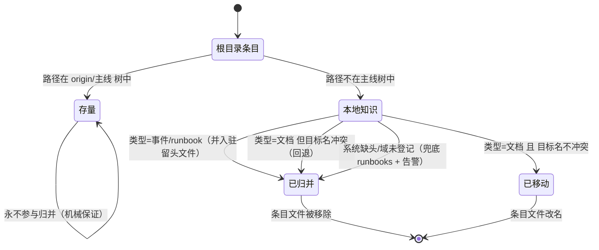
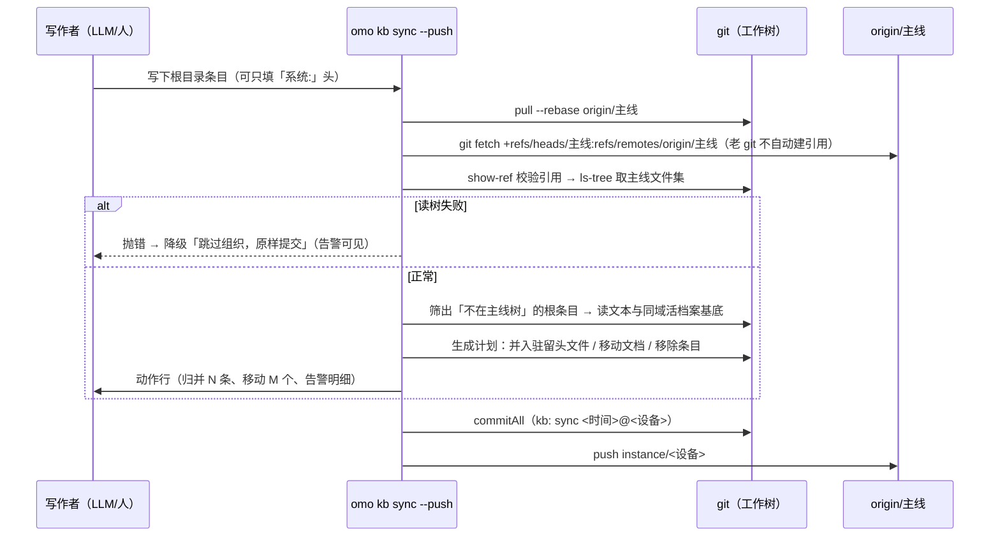

# 模块业务规则专项：知识归并机制（KBORG-1 organize）

> 产出方式：`codebase-graph-module-rules` 技能（Graphify 图谱 + 源码复核）
> 目标模块：`omo kb sync --push` 的**域活档案机械归并**链路
> 项目：oh-my-ops（`/workspace`）· 版本锚点：v0.14.3 · 产出日期：2026-09-22

## 0. 范围与证据边界

### 已知事实

- 归并机制由两层构成：**判据层**（哪些根条目参与归并，`kb-sync.ts:169-207`）与**纯函数层**（怎么归并，`kb-org.ts` 全部）。
- 归并产物只有三种落点：并入 `<域>/README.md` 活档案 / 移动为 `<域>/<slug>.md` / 兜底域 `runbooks/`。
- 归并发生在 `commitAll` **之前**（`kb-sync.ts:219-236` 在 `kb-sync.ts:238` 的 commit 之前），即产物随本次 sync 提交一起进实例分支。

### 信息缺口

- `fs.readdir` 的返回顺序在 glibc/ext4 上的稳定性未做断言（本模块**不承诺**稳定的目录枚举顺序）→ 见「待确认 §9-1」。
- 老 git（1.8.3.1）与新版 git 的分支枚举差异仅在真机验证过（.122 / .123），CI 使用新版 git。

### 冲突与时效

- 无业务文档与代码冲突。历史方案曾含 `<域>/archive/` 目录，**实现中已取消**（归并即入活档案，git 历史充当存档），以代码为准。

### 范围外

- 合流期 lint 门禁（`scripts/lib/kb-lint.mjs` + 服务端 `/kb/webhook`）= **相邻模块**，本文只写依赖边界（§1.4）。
- 凭据供给/轮换、服务端 `/ui`、实例 enroll：范围外，仅作上下游引用。
- 存量 33 篇历史文档的迁移：决策上**不做**（Owner 决定），不属本模块行为。

### 最小假设

- 工作副本为 git 仓库且 `origin` 可解析（否则进入本地模式，归并不执行）。
- 判定「存量」以 `origin/<主线>` 的树为唯一事实源（不依赖工作区跟踪状态）。

---

## 1. 模块定义与关系图

### 1.1 目标与角色

把**实例本地新写下的知识**在推送前自动归位到域活档案结构，让「知识组织」由机制而非人工约定保证：写作者只需填 `系统:` 头，其余（落域、去重位置、文件移除）由工具完成。

### 1.2 触发（Trigger）

| 触发入口 | 条件 | 来源 |
|---|---|---|
| CLI：`omo kb sync --push` | `push: true` 且 `OMO_KB_ORGANIZE !== "off"` | `kb-cli.ts:175`（`--push` 解析）→ `kb-cli.ts:84`（实参下传）→ `kb-sync.ts:167-169` |
| 知识工具：`gitSync()`（agent 侧知识工具调用） | 该调用**恒为** `push: true` | `tools/knowledge.ts:29,51` |
| 非触发：定时同步循环 | `push: false`（只拉主线，不归并） | `kb-cli.ts:135` |
| 非触发：状态查询 | `push: false` | `kb-cli.ts:161` |

### 1.3 输入 / 输出

| 类别 | 内容 |
|---|---|
| 输入 | 工作树根目录的 `.md` 条目（含 `系统/类型/主题` 头）、`domains.yml`（可选，缺省内置域表）、`origin/<主线>` 树、当前设备名、时间 |
| 输出 | ① `<域>/README.md` 活档案（新增/追加带日期小节）② `<域>/<slug>.md` 独立文档 ③ 条目文件被移除 ④ 控制台动作行（含告警）⑤ 随 commit 进 `instance/<设备>` 分支 |

### 1.4 依赖边界



### 1.5 关系图（触发 → 决策 → 数据 → 外部结果）



---

## 2. 实体与状态

### 2.1 实体

| 实体 | 载体 | 关键属性 | 生命周期 |
|---|---|---|---|
| 条目（Entry） | 根目录 `.md` 文件 | `系统`（域）/`类型`（事件·文档·runbook）/`主题`/正文 | 创建 → 归并或移动 → 从根目录移除 |
| 活档案（Living doc） | `<域>/README.md` | 域内知识唯一容器；小节 = `## <日期> <主题>（来源设备：<设备>）` | 不存在 → 骨架 → 追加小节（幂等） |
| 独立文档 | `<域>/<slug>.md` | ASCII kebab 文件名；正文含 `系统:` 头 | 移动生成；同名冲突回退为活档案小节 |
| 主线树快照 | `origin/<主线>` 的 ls-tree 输出 | 判「存量 vs 本地知识」的唯一依据 | 每轮 sync 重建 |

### 2.2 条目状态机



---

## 3. 主流程



---

## 4. 规则表（三层）

### 4.1 资格过滤（能否进入归并候选）

| # | 条件 | 结果 | 来源 |
|---|---|---|---|
| F1 | `OMO_KB_ORGANIZE=off` | 整块跳过，原样提交 | `kb-sync.ts:169` |
| F2 | 文件不以 `.md` 结尾 | 排除（`.json` 等快照不动） | `kb-sync.ts:204` |
| F3 | 文件在根白名单（`README.md`/`PREFIX-REGISTRY.md`/`domains.yml`，可由 domains.yml 扩展） | 排除 | `kb-sync.ts:203-204`；`kb-org.ts:25` |
| F4 | 文件名以 `.` 开头 | 排除 | `kb-sync.ts:204` |
| F5 | 路径**在 `origin/<主线>` 树中** | 排除（=存量，机械不动） | `kb-sync.ts:192,199-204` |
| F6 | 引用存在但 `ls-tree` 失败 | 抛错 → 外层降级「跳过组织」 | `kb-sync.ts:194-197` |
| F7 | 引用不存在（主线尚无提交） | mainTree 为空集 ⇒ 全部根条目视为本地知识 | `kb-sync.ts:185-188` |

### 4.2 候选排序

| 项 | 事实 | 说明 |
|---|---|---|
| 排序键 | **无显式排序** | 候选按 `fs.readdir` 枚举顺序进入计划（`kb-sync.ts:203`） |
| 并列行为 | 同域多条目在内存 map 中**顺序追加**至同一活档案 | `kb-org.ts:185-191` |
| 终止条件 | 候选集处理完即止；不迭代、不回溯 | `kb-org.ts:172` 单层循环 |
| 影响 | 小节在活档案中的先后 = 目录枚举顺序，**不承诺稳定**（见 §9-1） | 业务语义不受影响（小节各自独立） |

### 4.3 运行时控制（落点决策与安全阀）

| # | 规则 | 行为 | 来源 |
|---|---|---|---|
| R1 | 域解析：`系统:` 头命中 domains.yml 白名单 | 落入该域 | `kb-org.ts:167-175` |
| R2 | 域未登记 或 缺 `系统:` 头 | 兜底 `runbooks`（fallback 域）+ 告警，**不抛错、不丢内容** | `kb-org.ts:93,174-177` |
| R3 | `类型=事件`（缺省）/`runbook` | 追加为活档案小节 + 移除条目文件 | `kb-org.ts:186-188` |
| R4 | `类型=文档` 且目标 `<域>/<slug>.md` 未被本次计划占用 | 移动为独立文档（正文含头，供 lint 校验一致性） | `kb-org.ts:176-184` |
| R5 | `类型=文档` 且目标名冲突 | 回退为活档案小节 + 告警 | `kb-org.ts:178-186` |
| R6 | 未知 `类型` 值 | 按「事件」处理 + 告警 | `kb-org.ts:95-96` |
| R7 | 幂等：小节标题（日期+主题+设备）已存在 | 原样返回，不重复追加 | `kb-org.ts:116-121` |
| R8 | 幂等：条目已归并 | 条目文件已移除 ⇒ 下轮零候选，天然幂等 | `kb-sync.ts:230` |
| R9 | 归并基底 | 同域现存活档案全文作为基底传入 ⇒ 远端新内容不被覆盖 | `kb-sync.ts:210-218`；`kb-org.ts:159-163` |
| R10 | 任何异常 | `catch` ⇒ 降级为原样提交 + 告警行，**绝不阻塞同步** | `kb-sync.ts:235-237` |

---

## 5. 决策表（判据矩阵）

| refCheck（引用存在？） | ls-tree 结果 | mainTree | 行为 | 风险控制 |
|---|---|---|---|---|
| 否 | 未执行 | 空集 | 全部根条目视为本地知识 ⇒ 归并 | 主线尚无提交，无误归并风险 |
| 是 | 成功 | 主线文件集 | 仅归并非存量条目 | **存量机械不动**（核心不变量） |
| 是 | 失败（exit≠0） | — | 抛错 ⇒ 跳过组织、原样提交 | 宁漏归并、不误归并（.122 事故后的失效安全） |
| fetch 物化失败 | — | — | 不读取引用（沿用后续判定） | fetch 为物化动作，失败不改变判定语义 |

---

## 6. 异常与运营分支

| 场景 | 现象 | 处置 | 证据 |
|---|---|---|---|
| 老 git（1.8.x）`fetch origin 主线` 不建 `refs/remotes/origin/主线` | 读树恒失败 | 显式 refspec 物化引用 | `kb-sync.ts:179-182`；真机 .122 |
| 老 git 不支持 `git -C` | 命令失败 | 判据命令改走 `cwd` 形态（与 GitCompat 同路径） | `kb-sync.ts:178-194` |
| `domains.yml` 缺失/损坏 | 用内置域表 | 不阻断；结构规则放宽 | `kb-org.ts:56-62` |
| 条目缺 `系统:` 头 | 兜底 runbooks + 告警 | 内容不丢，位置可后调 | `kb-org.ts:93` |
| 同域多设备同时追加活档案 | 合并期为相邻小节冲突 | 中心评审合并（小节独立、冲突面小） | 设计文档 §1 |
| 组织步骤任一步失败 | 动作行「⚠ 组织步骤失败（已跳过，按原样提交）」 | 同步仍成功，知识不丢 | `kb-sync.ts:235-237` |

---

## 7. 测试范围与用例矩阵

### 7.1 现有覆盖（回归资产）

| 文件 | 用例数 | 覆盖点 |
|---|---|---|
| `packages/ops-extension/test/kb-org.test.ts` | 11 | 域表解析/条目头解析/小节幂等/多域不串/未知域兜底/文档同名回退/slug 归一 |
| `packages/ops-extension/test/kb-sync.test.ts` | 18 | 存量原地不动（`kb-sync.test.ts:38`）/只推实例分支/凭据不入库/漏推仍推/基底保留 |
| `packages/ops-extension/test/kb-lint.test.ts` | 7 | （相邻模块）结构规则/相似度阈值/HMAC |

### 7.2 P0 / P1 矩阵

| ID | 优先级 | 前置数据 | 动作 | 断言 | 可观察证据 |
|---|---|---|---|---|---|
| T-01 | P0 | 主线树含 `legacy.md`；根目录另有 `new.md`（无头） | `sync --push` | `legacy.md` 原地保留；`new.md` 进 `runbooks/README.md` 并移除 | 动作行「归并：1 条」；`git ls-tree` |
| T-02 | P0 | 条目 `系统: omo-kb` 含 `类型: 事件` | 同上 | 小节标题 = `## <日期> <主题>（来源设备：<设备>）` | 活档案文件内容 |
| T-03 | P0 | 已归并条目（文件已移除） | 再次 `sync --push` | 无新增小节、无变更提交 | 动作行「无本地改动，无需提交」 |
| T-04 | P0 | 两实例同域各自追加 | 合并两实例分支 | 两小节共存，无内容丢失 | 合并后活档案 |
| T-05 | P0 | 模拟读树失败（引用存在但 ls-tree 报错） | `sync --push` | 抛错被兜底；条目不归并、原样提交 | 动作行「⚠ 组织步骤失败」 |
| T-06 | P0 | 主线尚无提交（首次同步） | `sync --push` | mainTree 空 ⇒ 本地条目全部归并 | 动作行「归并：N 条」 |
| T-07 | P1 | `类型: 文档` 且同名目标已存在于计划 | `sync --push` | 回退为活档案小节 + 告警 | 动作行告警文本 |
| T-08 | P1 | 缺 `系统:` 头 | `sync --push` | 兜底 runbooks + 告警，内容完整 | 动作行告警 + runbooks 活档案 |
| T-09 | P1 | `OMO_KB_ORGANIZE=off` | `sync --push` | 归并整体跳过，条目原样提交 | 动作行无「归并」行 |
| T-10 | P1 | 未知 `类型: 超级文档` | `sync --push` | 按事件处理 + 告警 | 动作行告警文本 |

> 外部依赖（git、文件系统）使用真实环境；无「桩」需求。所有断言均在本地工作树/裸仓可观察，**不依赖生产环境**。

---

## 8. 待确认（未验证 / 需 Owner 或后续举证）

| # | 事项 | 现状 | 影响 |
|---|---|---|---|
| 1 | `fs.readdir` 枚举顺序的稳定性 | 未断言 | 仅影响小节在活档案中的先后；不改变语义 |
| 2 | ~~图谱 INFERRED 边~~ **已核实**：本模块相关边全为 EXTRACTED；图谱另发现入口②（已源码确认并补入 §1.2） | 已闭环 | 无 |
| 3 | 老 git（<2.3）与本模块全部交互面 | 仅在 .122（1.8.3.1）验证过 sync 主链；`git ls-remote`/`show-ref` 组合未穷举 | 潜在兼容缺口，建议纳入实例升级回归 |

---

## 9. 代码追溯

| 事实 | 来源 |
|---|---|
| 归并触发与开关 | `packages/ops-extension/src/kb-sync.ts:167-169` |
| 调用方①：CLI 同步（--push 语义） | `packages/ops-extension/src/kb-cli.ts:68,74,84,175` |
| 调用方②：知识工具同步（恒 push=true） | `packages/ops-extension/src/tools/knowledge.ts:29,51` |
| 非触发调用方（push=false） | `packages/ops-extension/src/kb-cli.ts:135,161` |
| 引用物化（老 git 兼容） | `packages/ops-extension/src/kb-sync.ts:179-181`（refspec 见 :180） |
| 判据：show-ref / ls-tree / 失效安全 | `packages/ops-extension/src/kb-sync.ts:184-201`（show-ref :185，ls-tree :192，抛错 :196） |
| 候选筛选公式 | `packages/ops-extension/src/kb-sync.ts:203-204` |
| 活档案基底传入 | `packages/ops-extension/src/kb-sync.ts:211-218` |
| 计划生成与落盘执行 | `packages/ops-extension/src/kb-sync.ts:219-230`（organizeEntries :219、移动 :220、写活档案 :225、移除条目 :230） |
| 降级与告警 | `packages/ops-extension/src/kb-sync.ts:231-237`（动作行 :232、catch :235-236） |
| 域表解析与默认值 | `packages/ops-extension/src/kb-org.ts:22-62` |
| 条目头解析与兜底 | `packages/ops-extension/src/kb-org.ts:75-107` |
| 小节生成与幂等追加 | `packages/ops-extension/src/kb-org.ts:110-121`（appendSection 幂等 :116） |
| 落点决策（事件/文档/冲突回退） | `packages/ops-extension/src/kb-org.ts:166-195`（域解析 :171、文档分支 :176-183、事件分支 :186-188、计划回传 :193） |
| slug 归一（ASCII kebab + doc- 前缀兜底） | `packages/ops-extension/src/kb-org.ts:143-148`（`doc-` 兜底 :146） |

---

## 10. 图谱证据（Graphify）

**建图**（结构图谱，无需 LLM）：`graphify update /workspace`
→ `1871 nodes / 3476 edges / 142 communities`；产物 `graphify-out/{graph.json,graph.html,GRAPH_REPORT.md}`
（7 个来源文件产出零节点，均为 `*-observations.json` 观测数据而非代码，与本模块无关。）

### 10.1 模块词查询（BFS depth=2）

```
graphify query "kb sync 归并 活档案 组织 判据 organizeEntries" --budget 700
→ Start: ['organizeEntries()', 'syncKb()', 'D5 需求来源与验收判据', '可执行技术方案：知识库组织 reform（KBORG-1）']
→ 133 nodes found
```

要点：图谱把**代码符号与设计文档（KBORG-1 方案 / 其 D5 节）**连成同一邻域——可作为“实现↔方案”追溯的辅助索引（事实仍以源码与方案正文为准）。

### 10.2 候选符号邻域（explain）

```
graphify explain "organizeEntries"
→ degree 9
  <-- syncKb()             [calls]    [EXTRACTED]
  <-- kb-sync.ts           [imports]  [EXTRACTED]
  <-- kb-org.ts            [contains] [EXTRACTED]
  <-- kb-org.test.ts       [imports]  [EXTRACTED]
  --> parseEntry() / sectionFor() / appendSection() / skeleton() / slug()  [calls] [EXTRACTED]
```

**全部为 EXTRACTED 边**（来源确认）——本文 §1.5 关系图与 §4 规则表的所有依赖方向均与图谱一致，**无 INFERRED 边需要列为待核实**。

### 10.3 反向影响（affected）

```
graphify affected "organizeEntries" --depth 2
→ kb-sync.ts [imports] · syncKb() [calls] · kb-org.test.ts [imports]
→ kb-cli.ts [imports_from] · runSync() [calls]          ← 入口①（前文已列）
→ knowledge.ts [imports_from] · gitSync() [calls]        ← 入口②（**图谱发现，本文原稿遗漏，已补入 §1.2**）
→ kb-sync.test.ts [imports_from]
```

### 10.4 路径查询

```
graphify path "runSync()" "organizeEntries()"
→ runSync() --calls [EXTRACTED]--> syncKb() --calls [EXTRACTED]--> organizeEntries()   （2 hops）
```

### 10.5 图谱作用的边界

图谱用于**发现**调用面与关系方向（本次即靠它补齐了入口②）；**规则语义**（判据、幂等、失效安全）全部由源码与测试确认，图谱不产生业务结论。

---

## 11. 验证记录

| 项 | 结果 |
|---|---|
| Skill 包自校验 | `python3 scripts/verify_skill_package.py .` → `skill package contract passed`（3 eval cases, prompt, metadata, references） |
| 单元/回归 | `bun test kb-org.test.ts kb-sync.test.ts kb-lint.test.ts` → **36 pass / 0 fail**（139+ 断言） |
| 全量门禁 | `npm run test:ci` → 退出码 0（含渲染验收 8/8、UI/lint 契约探针） |
| 真机验收（外部） | .122（git 1.8.3.1）实测：存量 32 篇原地保留、1 条归并、实例分支仅 +6 行零删除 |
| 文档自检 | 引用行号对齐 v0.14.3 源码（22 处精确化 + 抽查全中）；无密钥/凭据内容；围栏配对 8、Mermaid 4 图、章节 §0~§11 齐备、零尾随空白 |
| 图谱流程 | `graphify update` 建图 + `query`/`explain`/`affected`/`path` 四类查询已执行，输出见 §10；据其补齐入口② |
